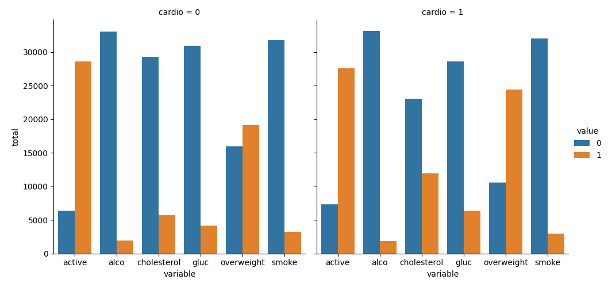
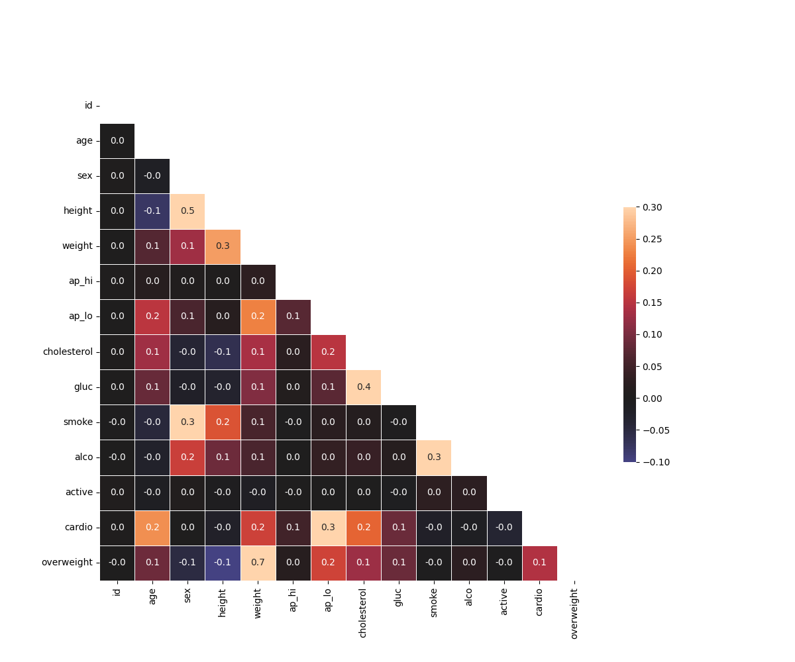

# 🩺 Medical Data Visualizer

This project is part of the FreeCodeCamp Data Analysis with Python Certification.
It analyzes medical examination data to identify health trends and visualize key correlations.

---

## 📊 Project Overview

The project answers questions like:

How lifestyle factors (smoking, alcohol, activity) relate to cardiovascular disease.

How cholesterol, glucose, and BMI levels vary across patients.

What variables are most correlated with cardiovascular disease.

The project generates two visualizations:

1. Categorical Plot – Shows distributions of risk factors by cardiovascular condition.

2. Heatmap – Displays correlations between health indicators.

## 🛠 Technologies Used

Python 🐍

Pandas 📊

Seaborn 🎨

Matplotlib 📈

NumPy 🔢

## 📂 Dataset

The dataset medical_examination.csv contains patient health records, including:

Demographics: age, height, weight

Vitals: blood pressure, cholesterol, glucose

Lifestyle: smoking, alcohol use, physical activity

Target: cardiovascular disease indicator

## 📸 Example Outputs

#### 🔹 Categorical Plot

  

#### 🔹 Correlation Heatmap

  

